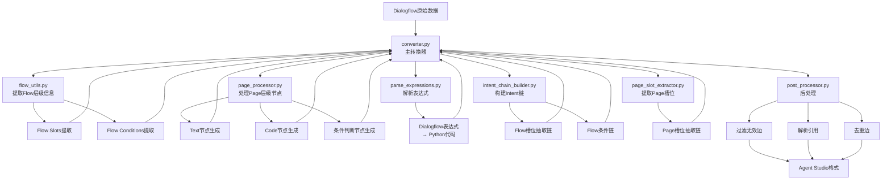
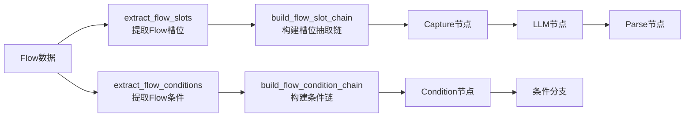
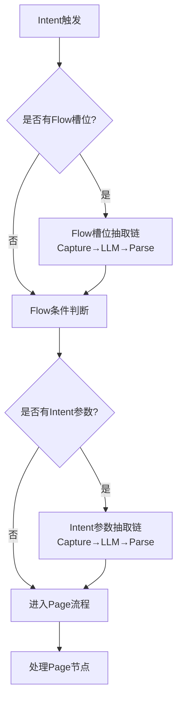
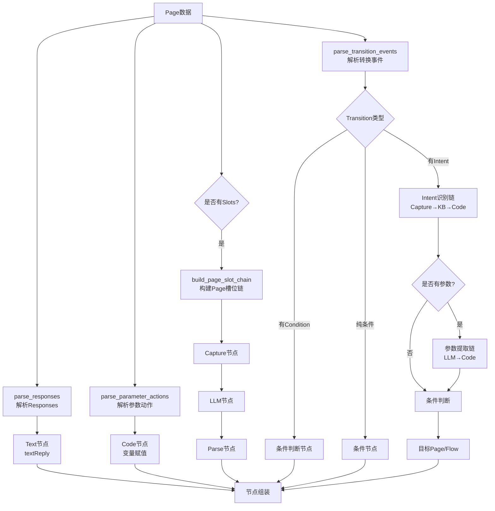
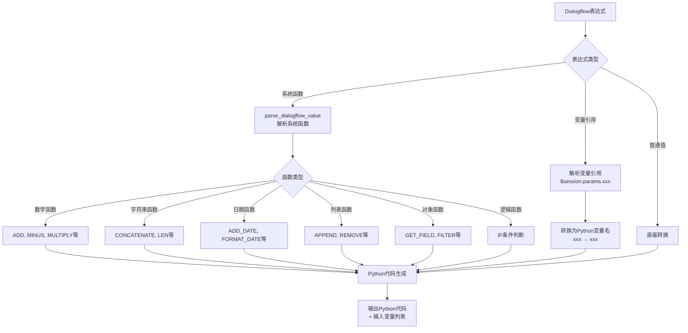
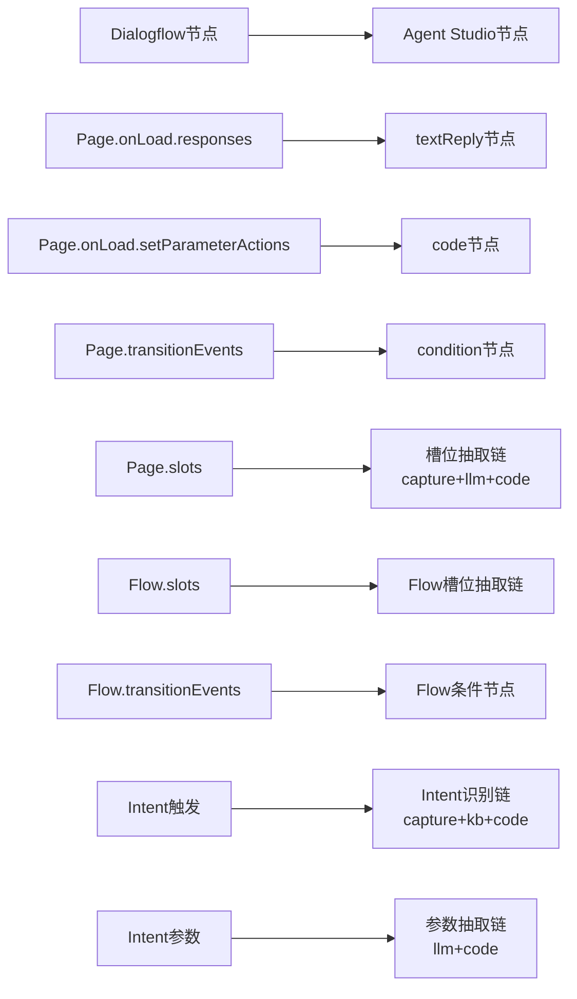
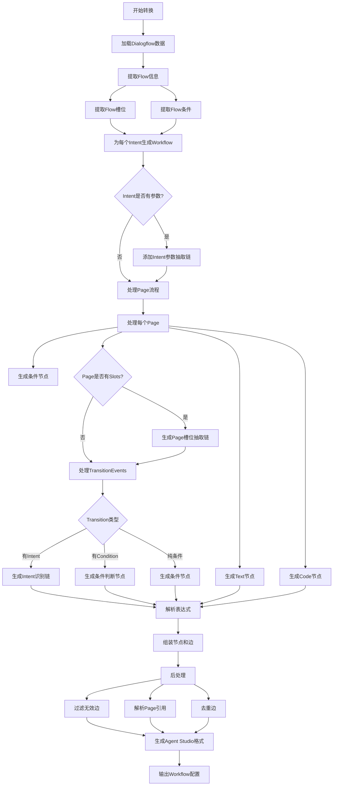

# Step2 转换逻辑流程图

## 核心模块架构

```mermaid
graph TB
    A[Dialogflow原始数据] --> B[converter.py<br/>主转换器]
    
    B --> C[flow_utils.py<br/>提取Flow层级信息]
    B --> D[page_processor.py<br/>处理Page层级节点]
    B --> E[parse_expressions.py<br/>解析表达式]
    B --> F[intent_chain_builder.py<br/>构建Intent链]
    B --> G[page_slot_extractor.py<br/>提取Page槽位]
    B --> H[post_processor.py<br/>后处理]
    
    C --> I[Flow Slots提取]
    C --> J[Flow Conditions提取]
    
    D --> K[Text节点生成]
    D --> L[Code节点生成]
    D --> M[条件判断节点生成]
    
    E --> N[Dialogflow表达式<br/>→ Python代码]
    
    F --> O[Flow槽位抽取链]
    F --> P[Flow条件链]
    
    G --> Q[Page槽位抽取链]
    
    H --> R[过滤无效边]
    H --> S[解析引用]
    H --> T[去重边]
    
    I --> B
    J --> B
    K --> B
    L --> B
    M --> B
    N --> B
    O --> B
    P --> B
    Q --> B
    R --> U[Agent Studio格式]
    S --> U
    T --> U
```

## Flow层级处理流程

```mermaid
graph LR
    A[Flow数据] --> B[extract_flow_slots<br/>提取Flow槽位]
    A --> C[extract_flow_conditions<br/>提取Flow条件]
    
    B --> D[build_flow_slot_chain<br/>构建槽位抽取链]
    D --> E[Capture节点]
    E --> F[LLM节点]
    F --> G[Parse节点]
    
    C --> H[build_flow_condition_chain<br/>构建条件链]
    H --> I[Condition节点]
    I --> J[条件分支]
```

## Intent处理流程

```mermaid
graph TB
    A[Intent触发] --> B{是否有Flow槽位?}
    B -->|是| C[Flow槽位抽取链<br/>Capture→LLM→Parse]
    B -->|否| D[Flow条件判断]
    
    C --> D
    D --> E{是否有Intent参数?}
    E -->|是| F[Intent参数抽取链<br/>Capture→LLM→Parse]
    E -->|否| G[进入Page流程]
    
    F --> G
    G --> H[处理Page节点]
```

## Page层级节点生成流程

```mermaid
graph TB
    A[Page数据] --> B[parse_responses<br/>解析Responses]
    A --> C[parse_parameter_actions<br/>解析参数动作]
    A --> D[parse_transition_events<br/>解析转换事件]
    A --> E{是否有Slots?}
    
    B --> F[Text节点<br/>textReply]
    C --> G[Code节点<br/>变量赋值]
    
    E -->|是| H[build_page_slot_chain<br/>构建Page槽位链]
    H --> I[Capture节点]
    I --> J[LLM节点]
    J --> K[Parse节点]
    
    D --> L{Transition类型}
    L -->|有Intent| M[Intent识别链<br/>Capture→KB→Code]
    L -->|有Condition| N[条件判断节点]
    L -->|纯条件| O[条件节点]
    
    M --> P{是否有参数?}
    P -->|是| Q[参数提取链<br/>LLM→Code]
    P -->|否| R[条件判断]
    
    Q --> R
    R --> S[目标Page/Flow]
    
    F --> T[节点组装]
    G --> T
    K --> T
    N --> T
    O --> T
    S --> T
```

## 表达式解析流程

```mermaid
graph TB
    A[Dialogflow表达式] --> B{表达式类型}
    
    B -->|系统函数| C[parse_dialogflow_value<br/>解析系统函数]
    B -->|变量引用| D[解析变量引用<br/>$session.params.xxx]
    B -->|普通值| E[直接转换]
    
    C --> F{函数类型}
    F -->|数学函数| G[ADD, MINUS, MULTIPLY等]
    F -->|字符串函数| H[CONCATENATE, LEN等]
    F -->|日期函数| I[ADD_DATE, FORMAT_DATE等]
    F -->|列表函数| J[APPEND, REMOVE等]
    F -->|对象函数| K[GET_FIELD, FILTER等]
    F -->|逻辑函数| L[IF条件判断]
    
    D --> M[转换为Python变量名<br/>xxx → xxx]
    
    G --> N[Python代码生成]
    H --> N
    I --> N
    J --> N
    K --> N
    L --> N
    M --> N
    E --> N
    
    N --> O[输出Python代码<br/>+ 输入变量列表]
```

## 节点类型转换映射

```mermaid
graph LR
    A[Dialogflow节点] --> B[Agent Studio节点]
    
    A1[Page.onLoad.responses] --> B1[textReply节点]
    A2[Page.onLoad.setParameterActions] --> B2[code节点]
    A3[Page.transitionEvents] --> B3[condition节点]
    A4[Page.slots] --> B4[槽位抽取链<br/>capture+llm+code]
    A5[Flow.slots] --> B5[Flow槽位抽取链]
    A6[Flow.transitionEvents] --> B6[Flow条件节点]
    A7[Intent触发] --> B7[Intent识别链<br/>capture+kb+code]
    A8[Intent参数] --> B8[参数抽取链<br/>llm+code]
```

## 完整转换流程（端到端）

```mermaid
graph TB
    Start[开始转换] --> A[加载Dialogflow数据]
    A --> B[提取Flow信息]
    B --> C[提取Flow槽位]
    B --> D[提取Flow条件]
    
    C --> E[为每个Intent生成Workflow]
    D --> E
    
    E --> F{Intent是否有参数?}
    F -->|是| G[添加Intent参数抽取链]
    F -->|否| H[处理Page流程]
    
    G --> H
    H --> I[处理每个Page]
    
    I --> J[生成Text节点]
    I --> K[生成Code节点]
    I --> L[生成条件节点]
    I --> M{Page是否有Slots?}
    
    M -->|是| N[生成Page槽位抽取链]
    M -->|否| O[处理TransitionEvents]
    
    N --> O
    O --> P{Transition类型}
    
    P -->|有Intent| Q[生成Intent识别链]
    P -->|有Condition| R[生成条件判断节点]
    P -->|纯条件| S[生成条件节点]
    
    Q --> T[解析表达式]
    R --> T
    S --> T
    J --> T
    K --> T
    
    T --> U[组装节点和边]
    U --> V[后处理]
    
    V --> W[过滤无效边]
    V --> X[解析Page引用]
    V --> Y[去重边]
    
    W --> Z[生成Agent Studio格式]
    X --> Z
    Y --> Z
    
    Z --> End[输出Workflow配置]
```
